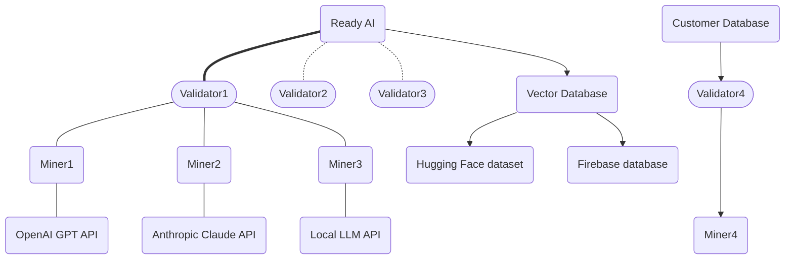

# NETUID 33 — ReadyAI

## CHAIN (live)
- miners: 256 | validators: 9
- miner emission: 55.967180179081495 TAO/day (rewarded miners: 244)
- alpha price: 0.019021329 | emissionEnabled: True
- on-chain description: 0x
- on-chain github: https://github.com/afterpartyai/bittensor-conversation-genome-project
- repo/registry description: --- --- ReadyAI is an open-source initiative aimed at provide a low-cost resource-minimal data structuring and semantic tagging pipeline for any individual or business.
- repo used: afterpartyai/bittensor-conversation-genome-project


## README (afterpartyai/bittensor-conversation-genome-project @ main/README.md)
### INTRO
[ ](https://discord.gg/bittensor)
[ ](https://opensource.org/licenses/MIT)

---
- [Conversation Genome Project](#conversation-genome-project-overview)
  - [Key Features](#key-features)
  - [Benefits](#Benefits)
  - [System Design](#System-Design)
  - [Task Types](#task-types)
  - [Rewards and Incentives](#reward-mechanism)
- [Getting Started](#Getting-Started)
  - [Installation & Compute Requirements](#installation--compute-requirements)
  - [Configuration](#configuration)
  - [LLM Selection](#LLM-Selection)
  - [Quickstart - Running the tests](#running-the-tests)
  - [Registration](#Registration)
  - [Get Running Quickly with the Docker Image!](#Running-a-Miner-or-a-Validator-with-Docker)
  - [Get a miner Running on Runpod](#Running-a-Miner-on-Runpod)
- [Subnet Roles](#subnet-roles)
  - [Mining](#mining)
  - [Validating](#validating)
- [Helpful Guides](#helpful-guides)
  - [Runpod](#Runpod)
  - [Managing Processes](#managing-processes)
  - [Making sure your port is open](#making-sure-your-port-is-open)
- [llms.txt Reference MCP](#llmstxt-reference-mcp)
- [License](#license)

---

### Introduction to ReadyAI
ReadyAI is an open-source initiative aimed at provide a low-cost resource-minimal data structuring and semantic tagging pipeline for any individual or business. AI runs on Structured Data. ReadyAI is a low-cost, structured data pipeline to turn your raw data into structured data for your vector databases and AI applications.

If you are new to Bittensor, please checkout the [Bittensor Website](https://bittensor.com/) before proceeding to the setup section.



### ReadyAI Overview
ReadyAI uses the Bittensor infrastructure to annotate raw data creating structured data, the “oil” required by AI Applications to operate.

### Mining
You can launch your miners on testnet using the following command.

To run with pm2 please see instructions [here](#Running-a-Miner-with-PM2)

If you are running on runpod, please read instructions [here](#Using-Runpod).

To setup and run a miner with Docker, see instructions [here](#Running-a-Miner-or-a-Validator-with-Docker).

```
python3 -m neurons.miner --subtensor.network test --netuid 138 --wallet.name <coldkey name> --wallet.hotkey <hotkey name> --logging.debug --axon.port <port>
```

Once you've registered on on mainnet SN33, you can start your miner with this command:

```
python3 -m neurons.miner --netuid 33 --wallet.name <wallet name> --wallet.hotkey <hotkey name> --axon.port <port>
```

### Running a Miner with PM2
To run a miner with PM2, you can use the following template:

```
pm2 start "python3 -m neurons.miner --netuid 33 --wallet.name default --wallet.hotkey default --logging.debug --axon.port <port>" --name "miner"
```

### How to Run a Bittensor Miner on Subnet 33 Using Runpod
This guide walks you through the process of deploying a Bittensor miner on Subnet 33 using [Runpod](https://runpod.io). In a few simple steps, you’ll go from zero to mining on the testnet or mainnet.

---

### 🌍 Make Sure Your Miner is Reachable
Validators need to be able to reach your miner's Axon port.

1. Click **Connect** on your pod.
     
2. Note the **Direct TCP** port (not port 22). This is your Axon port and **must** be publicly accessible.
     

To test if it's reachable:

```
curl <YOUR_POD_IP>:<AXON_PORT>
```

You should:
- Get a JSON-like response in your terminal
     
- See logs in your miner indicating it received a connection
     

---

### 🔑 Registering your miner
You will need:
- Enough Tao to pay the registration fee

You can register by following these steps:
1. Connect via SSH into your miner as explained [here](#Connect-via-SSH)
2. Run the following command and complete the prompts:
```
btcli s register --netuid 138 --wallet.name default --wallet.hotkey default --network test --wallet.path /workspace/wallets
```

You can change the `--netuid` to `33` and the `--network` to `finney` if you want to register on the main Bittensor network

---

### 🎉 Your Miner Is Live!
You should now see logs indicating that the miner is running and active. When it actually handles validator requests, you will see logs like this:
 
> It can take up to 1 hour before validators send requests to your miner.

---

### Validating
To run a validator, you will first need to generate a ReadyAI Conversation Server API Key. Please see the guide [here](docs/generate-validator-api-key.md). If you wish to validate via local datastore, please see the section below on [Validating with a Custom Conversation Server](#validating-with-a-custom-conversation-server)

You can launch your validator on testnet using the following command.

To run with pm2 please see instructions [here](#Running-a-Validator-with-PM2)

If you are running on runpod, please read instructions [here](#Using-Runpod)

To setup and run a validator with Docker, see instructions [here](#Running-a-Miner-or-a-Validator-with-Docker).

### Running a Validator
```
python3 -m neurons.validator --subtensor.network test --netuid 138 --wallet.name <wallet name> --wallet.hotkey <hotkey name> --logging.debug --axon.port <port>
```

Once you've registered on on mainnet SN33, you can start your miner with this command:

```
python3 -m neurons.validator --netuid 33 --wallet.name <wallet name> --wallet.hotkey <hotkey name> --axon.port <port>
```

### Validating with a Custom Conversation Server
Validators, by default, access the ReadyAI API to retrieve 
