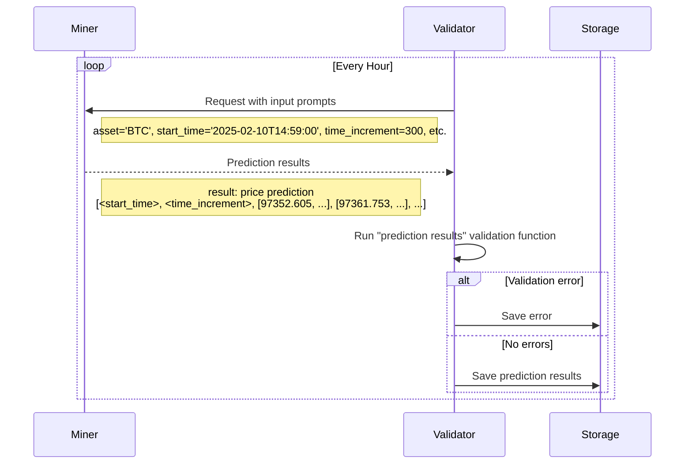

# NETUID 50 — Synth

## CHAIN (live)
- miners: 256 | validators: 7
- miner emission: 50.78464538585185 TAO/day (rewarded miners: 245)
- alpha price: 0.017203549 | emissionEnabled: True
- on-chain description: Predictive intelligence for financial markets and beyond
- on-chain github: https://github.com/mode-network/synth-subnet
- repo/registry description: > TL;DR — Miners submit ensembles of simulated price paths for a basket of crypto, equity, and commodity assets across two timeframes (24h and 1h).
- repo used: mode-network/synth-subnet

## README (mode-network/synth-subnet @ main/README.md)
### INTRO

  

<h1 align="center">
    Synth Subnet
</h1>

    <a href="https://www.synthdata.co" target="_blank">
        <b>Website</b>
    </a>
·
    <a href="https://github.com/synthdataco/synth-subnet/blob/main/Synth%20Whitepaper%20v1.pdf" target="_blank">
        <b>Whitepaper</b>
    </a>
·
    <a href="https://discord.gg/gnt8sFMdg6" target="_blank">
        <b>Discord</b>
    </a>
·
    <a href="https://api.synthdata.co/docs" target="_blank">
        <b>API Documentation</b>
    </a>

---

[ ][license]

---

### 🔭 1. Overview
> **TL;DR** — Miners submit ensembles of simulated price paths for a basket of crypto, equity, and commodity assets across two timeframes (`24h` and `1h`). Validators score each ensemble with CRPS on price changes over multiple time increments (plus realized volatility for Crypto 1h), take a rolling weighted average within a per-timeframe window (10 days for `24h`, 5 days for `1h`), and allocate emissions via softmax — equally split between 3 competitions: Crypto 1h, Crypto 24h, Commodities/Equities 24h. Lower CRPS → more emissions.

### 1.1. Introduction
The Synth Subnet leverages Bittensor’s decentralized intelligence network to create the world's most powerful synthetic data for price forecasting. Unlike traditional price prediction systems that focus on single-point forecasts, Synth specializes in capturing the full distribution of possible price movements and their associated probabilities, to build the most accurate synthetic data in the world.

Miners in the network are tasked with generating multiple simulated price paths, which must accurately reflect real-world price dynamics including volatility clustering and fat-tailed distributions. Their predictions are evaluated using the Continuous Ranked Probability Score (CRPS), which measures both the calibration and sharpness of their forecasts against actual price movements.

Validators score miners on short-term and long-term prediction accuracy, averaging each miner's per-request scores over a short rolling window so that recent performance dominates. Daily emissions are allocated based on miners’ relative performance, creating a competitive environment that rewards consistent accuracy.

     

Figure 1.1: Overview of the synth subnet.

The Synth Subnet aims to become a key source of synthetic price data for AI Agents and the go-to resource for options trading and portfolio management, offering valuable insights into price probability distributions.

[Back to top ^][table-of-contents]

### 1.2. Task Presented to the Miners

Miners are tasked with providing probabilistic forecasts of an asset's future price movements. Specifically, each miner is required to generate multiple simulated price paths for an asset, from the current time over specified time increments and time horizon. The network currently runs two competitions distinguished by their forecast timeframe — `24h` and `1h` HFT — and the supported assets on each are listed in the parameter sections below.

The asset set has grown over time:

| Date       | Change                                                                                                                                                                                                                |
| ---------- | --------------------------------------------------------------------------------------------------------------------------------------------------------------------------------------------------------------------- |
| Launch     | BTC only on the `24h` competition. 100 simulated paths, 5-minute increments.                                                                                                                                          |
| 2025-11-13 | Bumped to 1000 paths; added ETH, SOL, XAU to the `24h` competition. Synth begins moving toward HFT.                                                                                                                   |
| 2026-01    | Added tokenized equities SPYX, NVDAX, TSLAX, AAPLX, GOOGLX to the `24h` competition.                                                                                                                                  |
| 2026-03    | Added XRP, HYPE, WTIOIL to the `24h` competition; added HYPE to the `1h` competition.                                                                                                                                 |
| 2026-06    | 

### 1.3. Validator's Scoring Methodology
The role of the validators is, after the time horizon has passed, to judge the accuracy of each miner’s predicted paths compared to how the price moved in reality. The validator evaluates the miners' probabilistic forecasts using the Continuous Ranked Probability Score (CRPS). The CRPS is a proper scoring rule that measures the accuracy of probabilistic forecasts for continuous variables, considering both the calibration and sharpness of the predicted distribution. The lower the CRPS, the better the forecasted distribution predicted the observed value.

### 2.2. Validators
Please refer to this [guide](./docs/validator_guide.md) for more detailed instructions on getting a validator up and running.

[Back to top ^][table-of-contents]
